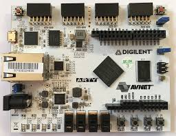

# Bubblesort_FPGA
this repository is dedicated to bubble sort algorithm in VHDL.


My FPGA model is:
**xc7a35tcsg324-1** 




I took the constraint file for the FPGA from the DIGILENT github:

https://github.com/Digilent/digilent-xdc/blob/master/Arty-A7-35-Master.xdc


I also use this peice of code on my cmd to open vivado :
````Bash
$ source /tools/Xilinx/Vivado/2021.1/settings64.sh
$ vivado
````
